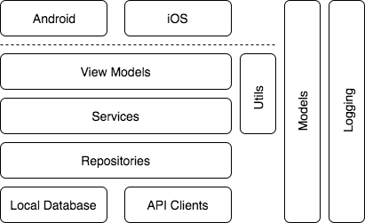

# XSlope

## Introduction

The XSlope libraries and solution are implemented to dramatically decrease the startup time for new solutions while providing a solid framework to build upon.

The following projects are included in the solution:

* STARTER_APP.Core
* STARTER_APP.Core.Tests
* STARTER_APP.Droid
* STARTER_APP.iOS
* XSlope.Core
* XSlope.Core.Tests
* XSlope.Droid
* XSlope.iOS

The XSlope projects are the "libraries" that provide some default implementations and base classes.

The bulk of the work will be done in the STARTER_APP projects which reference the XSlope projects. 

The included rename.sh script will handle updating the solution, project and namespaces according to the user's project.

## Getting Started

#### .NET Core Requirements
* Install .NET Core 2.0 SDK [Download](https://github.com/dotnet/core/blob/master/release-notes/download-archives/2.0.0-download.md)

#### IDE Requirements (assuming development on Mac):
* Latest Visual Studio for Mac
* Latest non-beta version of Xcode

#### iOS SDK Requirements and Setup
1. Go to Preferences > Projects > SDK Locations > Apple
2. Make sure SDK path points to correct version of Xcode (latest non-beta version)

#### Android SDK Requirements and Setup
1. Go to Tools > SDK Manager
2. Confirm that the *Android SDK Platform ##* for the targeted SDK (found in the AndroidManifest) is installed
3. Install the *Android SDK Platform ##*, *Google APIs Intel x86 Atom System Image* and *Google APIs* options for any API version you wish to make an emulator for.

If you need to run an Android emulator, one created using the Google APIs tend to have better performance.

1. Go to Tools > Google Emulator Manager
2. Click on "Create..."
3. Choose your Device: recommend Nexus 5/6 for phones and Nexus 9/10 for tablets
4. Choose your Target: select the Google APIs target for the API version you wish to use
5. Choose your CPU/AB: select Google APIs Intel Atom (x86)
6. Choose your skin: select "No skin"
7. Choose your cameras: select "Emulated" for both front and back cameras
8. Ensure that the "Use Host GPU" checkbox is marked
9. Name your device and then hit "OK" to create your emulator

#### Libraries Used
* [JSON.NET](http://www.newtonsoft.com/json)
* [Ninject](https://github.com/onovotny/ninject/)
* [ReactiveUI](https://github.com/reactiveui/ReactiveUI)
* [Akavache](https://github.com/akavache/Akavache)
* [ModernHttpClient](https://github.com/paulcbetts/ModernHttpClient)
* [Serilog](https://github.com/serilog/serilog-sinks-xamarin)
* [xUnit](https://github.com/xunit/xunit)
* [Moq](https://github.com/moq/moq4)

## Architecture


The solution is designed to shared as much code as possible while still allowing established design patterns for each platform. At a high-level, data will come from an API and cached into our local database. This coordination is handled by our Repositories. Only the Repository classes should access the cache and API clients for data transactions. On top of our Repository layer sits the Service layer. The Services are responsible for any manipulation to data retrieved from the Repositories or coordinating multiple calls to Repositories or other services. Our ViewModels are responsible for handling the view logic for both platforms. The ViewModels will inject Services, Providers and Managers as needed. On top of our ViewModels is the UI for each platform, this is where we break out of shared code. The UIs for Android and iOS will be built separately and handle their own navigation.

#### Dependency Injection
Dependency injection is used throughout the solution and is implemented using Ninject. Each platform has a PlatformContainerModule where you can register platform specific classes. The PlatformContainerModule derive from ContainerModule which lives in our Core project and handles the registration of all our shared classes. In general, we should rely on constructor injection and use property injection where necessary (Activities, Fragments, ViewControllers).

#### API Client
The current REST client is setup to use .NET’s HTTPClient along with the ModernHttpClient library. ModernHttpClient allows code to be implemented using HTTPClient, but with the performance of native libraries (NSURLSession and OkHttp). BaseClient has async methods to support GET/POST/PUT/DELETE. Any non-success responses will throw an ApiClientException which includes the HttpResponseMessage. These exceptions should be caught and the UI adjusted as necessary.

#### Database/Cache
The solution is setup to use Akavache as a way to persist data. This is a library that sits on top of a SQLite database and allows simple key/value persistence. The CacheManager is a singleton that creates and is the entry point into various caches (databases). The CacheManager can be extended as needed by the application to hold a number of CacheProviders. For example, you may have an AppCache and a SessionCache and the SessionCache could easily be invalidated when a user logs out. Caches can also be setup to encrypt/decrypt all data using Akavache’s SQLiteEncryptedBlobCache.

#### Repository
The Repository classes are how our Services will handle CRUD-like methods for our data. It’s not required for a Repository to use both an API Client and a Cache, but it is available depending on application requirements. A true offline app would only use the Cache, while an app that doesn’t need any offline support could get by with just using the API Client.

#### Services
The Services are responsible for providing the coordiation between ViewModels, Repositories and other Services. This could be a simple pass-through from a Repository, chaining multiple Service or Repository calls together, or even manipulating data from a Repository response as needed by the ViewModels. Services are generally only referenced by the ViewModels

#### ViewModels
ViewModels are responsible for the view logic. In order to bind our UIs to the ViewModels, we take advantage of the ReactiveUI library. There are many MVVM frameworks available and the decision to use ReactiveUI was simply to limit how much the solution is coupled to an MVVM framework. Many frameworks, such as MVVMCross, do a great job of handling DI, binding and navigation. However, coupling our solution so tightly to the MVVM framework can slow velocity of our engineers and can get in the way of utilizing established patterns on each platform. More on this below, but at a high-level our BaseViewController and BaseFragment classes are where we tie into the ReactiveUI framework with the SetupBindings and SetupActions methods.

ViewModels should use a static NewInstance method when we need to create the instance with BOTH injected arguments and other non-injected arguments. For example:

```
public static SomeViewModel NewInstance(int id)
{
var viewModel = DependencyContainer.Get<SomeViewModel>();
viewModel._id = id;
return viewModel;
}

int _id;
public SomeViewModel(ISomeService someService) { }
```

ViewModels that only have injected arguments or non-injected arguments can just use a constructor:
```
public SomeViewModel(ISomeService someService) { }

public SomeOtherViewModel(int id) { }
```

#### iOS
The main class in this solution is the BaseViewController. Our view controllers should extend from this class. BaseViewController itself is setup to work with ReactiveUI ViewModels. It also calls into or container to handle any property injections we are using on our ViewControllers. The main methods our ViewControllers will be overriding are: CreateViewModel, SetupBindings and SetupActions.

BaseView is another base class that provides quite a bit of framework. Similar to BaseViewController, it is coupled to a BaseViewModel. Whether the custom views are added in Interface Builder or programatically created, you'll need to set the View's ViewModel to trigger many of the methods needed to setup the view.

CreateViewModel is a virtual method which defaults to returning the ViewModel that resolves from our container. Our custom ViewControllers may need to override in order to pass objects, such as models or Ids, to the resolved ViewModels.

SetupBindings is where our controls will bind to the ViewModel’s properties and commands. The reason for extracting view logic into the ViewModel is to avoid duplicating work between platforms and to also enabled easier unit testing by not relying on a specific platform.

SetupActions is where our custom ViewControllers can setup their own callbacks from the ViewModel. Another option is to allow for Observables on the ViewModel, but explicit callbacks tend to be easier to work with. If there are many related Actions you need to setup, consider an interface and let your custom ViewController act as a delegate on your ViewModel.

#### Android
There are a couple options as to where your UI is implemented. The controls can be directly added to the Activity’s layout or to a Fragment’s layout (the Fragment is then added to the Activity’s layout). The pattern we will use is “Always Use Fragments”, taken from Big Nerd Ranch. Each screen will have its own Activity and that Activity’s layout will hold one or more Fragments. The actual UI will be implemented in the Fragment. Implementing a Fragment just to drop it into an Activity (as opposed to building the UI directly on the Activity) may seem like extra work. It is a bit more work, but it allows us to have consistent patterns in place throughout the app. Also, one of the biggest benefits is that if the screen does change and other Fragments need to be added or re-used we won’t wasted time converting from an Activity to a Fragment. A lot of this setup is handled in our BaseActivity and BaseFragment classes.

BaseActivity is responsible for a few key tasks. First, it will inject the class to allow for any property injection. Next, it will set its content view. This defaults to using the BaseActivity layout which currently consists of a LinearLayout containing a single FrameLayout (screen_container) which our Fragment layouts can be added to. This BaseActivity layout can be customized per your app requirements to include things like a toolbar, menu, action buttons, etc. The ConfigureFragments method is where our custom Activities can create and add the required Fragments to the UI. Should your custom Activity need its own layout it can override the CustomActivityLayout property. This is commonly used for screens that hold multiple fragments.

As mentioned above, our UI will be implemented in our Fragments. Therefore, our BaseFragment class is responsible for owning and configuring the ViewModel. Similar methods and patterns used for BaseViewController are used in BaseFragment. Details on CreateViewModel, SetupBindings and SetupActions can be found above in the iOS section.

BaseLinearLayout is another base class that provides quite a bit of framework. Similar to BaseFragment, it is coupled to a BaseViewModel. Whether the custom views are added directly to the layout file or programatically created, you'll need to set the View's ViewModel to trigger many of the methods needed to setup the view. Your custom view's layout root must be a LinearLayout in order to subclass the BaseLinearLayout. This is usually the most commonly used ViewGroup, but if others are needed then a new base class would need to be created to support them.

The SplashActivity is setup as the Launch Activity for the app. To have a true splash screen, you can set the windowBackground to a drawable for you Splash's theme.

## Connecting the ViewModels to the UI

There are a few patterns to use to connect the ViewModel to the platform Views. Below are the common scenarios we have:

#### One-Way and Two-Way Bind
This is used when we need to bind data between the ViewModel to the View. If the View does not update the ViewModel, for example binding a ViewModel string to a label, then the ReactiveUI OneWayBind should be used. If the View does update the ViewModel, for example a text field, then two-way bind should be used via the ReactiveUI Bind method.

#### ViewModel Commands
ReactiveUI's BindCommand is used to connect a Button/UIButton click event to a ReactiveCommand on the ViewModel. 

#### ViewModel Actions
At times binding ViewModel data to the View is not an easy solution. If for example the ViewModel loaded data asyncronously and created a datasource, we need a way to get the datasource to the Views for the Android adapter or iOS UITableViewDatasource to use. The way we pass this data back to the Views is via Action properties on the ViewModel. During View setup, the SetupActions method can be overridding to setup the callbacks back into the View to handle these scenarios.

#### View app tap handlers
While BindCommand can be used to trigger methods in the ViewModel for buttons, sometimes we need to handle tap actions on other custom controls such as a View. Each platform has an AddTapHandler extension method that setups a tap handler to invoke an Action. The Action would use should be a method on the ViewModel to consolidate all logic to the ViewModel. Generally these methods shouldn't have any parameters since any data needed for the logic should be available already on the ViewModel.

## Other notable classes

#### Converters
Converters are used to bind ViewModel properties to the View if the data types do not match or the View needs to run some custom logic for the binding. A BaseConverter class is available to help create custom Converters.

#### Providers/Managers
Providers and Managers are intended to make either specific information or classes available. This could be information on the current device’s culture, proxy methods to a cache implementation, information on the currently logged in user, etc. Generally the Managers tend to resolve as singletons while Providers resolve as instances, but this isn't necessarily a strict rule.

#### Datasources
Datasources are shared classes responsible for the logic involved with displaying a list. ViewModels will create and hold a reference to the Datasource. This class will provide information regarding number of items, item at a specific position, number of sections, etc. IUITableViewDataSource and RecyclerView.Adapter will both take advantage of our Datasource classes.

#### Utils
Util classes are static classes that are used to extract out logic so that it can easily be unit tested. An important thing to note is that these classes should be stateless.

#### Handlers
Handlers are generally interfaces we use to provide concrete platform implementations to the ViewModels. Our BaseViewController and BaseFragment classes implement quite a few handlers to allow the ViewModels to do platform-specific things like: show progress huds, nagivate to websites, hide the keyboard, etc. 

## Strings
Strings are handled in the Core project’s LocalizedStrings.txt files. Currently, only English is included, but other locales can be added as necessary. Entries added to the txt file are automatically generated in the resx file and as static properties in the LocalizedStrings class.

#### Add a new locale
1. Create new text file with same name prefix (ie: LocalizedStrings.de.txt)
2. Copy/Paste contents of original LocalizedString.txt file as a starting point
3. Add Custom Command in Project Options.
    1. Add a new Before Build Command
        Command: resgen [NEW FILE NAME].txt [NEW FILE NAME].resx
        Working Directory: /${ProjectDir}/../Core/Resources/
    2. Repeat steps b for all Configurations
    3. Press OK to save changes
4. Build Project
5. Import New Localization resx file
    1. Import the new resx file into the project from the same working directory as 3b
    2. Right click on the new resx file and change Build Action > EmbeddedResource

#### Add a new string
1. In the LocalizedStrings.txt file, add an entry with the format of ```[LOCALIZED_KEY]=[LOCALIZED_VALUE]```

## Colors
Colors are named and assigned in the Core project’s Colors.txt file. To add a new color, complete the following steps:

1. Add a new entry to the Colors.txt file in the format of: white=#FFFFFF
2. Build the Core project. This project has a build step to run the GenerateColors script. This script will update the Droid.Colors.xml and the iOS.Colors.cs files.

## Logging
Logging is done through the static Logger class. This is a wrapper that calls through to methods on a resolved ILoggerProvider instance. Both Android and iOS has LoggerProvider implementations using Serilog. If the static Logger instance doesn't fit your needs, you can inject the ILoggerProvider where it is required.

## Code Snippets
These can be added to Visual Studio to help speed up commonly used code blocks.

#### vmprop (ViewModel property)

Text Template

```
$type$ $fieldName$;
public $type$ $propertyName$
{
    get => $fieldName$;
    set => SetProperty(ref $fieldName$, value);
}
```

#### owb (One Way Bind)

Text Template

```
this.OneWayBind(ViewModel, vm => vm.$vmProp$, v => v.$viewProp$);
```

#### twb (Two Way Bind)

Text Template

```
this.Bind(ViewModel, vm => vm.$vmProp$, v => v.$viewProp$);
```

#### fv (Android Find View)

Text Template

```
view.FindView(ref $field$, Resource.Id.$resourceId$);
```

## Code Style Guidelines

#### Formatting
Consistent formatting is important to maintain a clean solution. Most of this is can be set in the solution's formatting or the IDE behavior settings. This can be changed based on team preference, but the current solution uses the following:

* use spaces instead of tabs
* braces start on new lines
* class fields are prefixed with an underscore, ```string _name;```
* constants are Pascal case, ```string BaseAddress = "https://slalom.com/api/v1";```
* do not include "private" for methods or fields
* prefer property shorthand when getter is a single line, ```public string Name => _user.Name;```

#### Order
In general, our classes should structure their contents in a consistent pattern. This can be changed based on team preference, but the current solution uses the following:

###### Fields
* constants
* fields

###### Constructors
* static NewInstance/NewIntent methods
* constructors

###### Properties
* public
* protected

###### Methods
* lifecycle methods
* public
* protected
* private

###### Interface Implementations
* wrapped in regions with region name the same as the interface

## Unit Tests
We have two methods to help us construct our objects for testing: GetMock<T> and Get<T>. Both of these methods call a mocked kernel class that will return a transient mocked object instead of a default singleton (https://github.com/ninject/Ninject.MockingKernel/wiki). This allows us to have multiple instances of a class type while testing lists.

GetMock<T>: This will return a Mock<T> object for the interface being requested. This allows us to call setup/verify on the object that will be resolved using the Get method mentioned below. This is intended to be used for interfaces, ie: GetMock<IDeviceService>()

Get<T>: This will resolve the class as normal. Any parameters that are required, the mock kernel will create a Mock<T> object for and inject. This is intended to be used with classes to allow for implicit self-binding and an actual object to be returned, ie: Get<SignInViewModel>().

There is ICacheManager/ICacheProvider setup that is done in BaseTest. Since we inject ICacheManager into our objects, then save the ICacheProvider in the class, we need a way to reference the mocked ICacheProvider held by the ICacheManager in our unit tests in order to handle setup/verify calls. We set this up in BaseTest and since GetMock ultimately uses singletons, we can call GetMock<ICacheProvider>() in our tests and that will be the same mock object used throughout.
